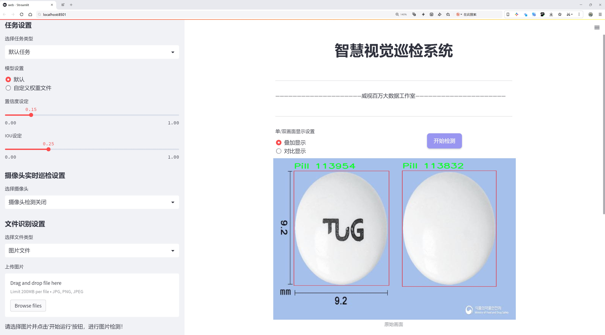
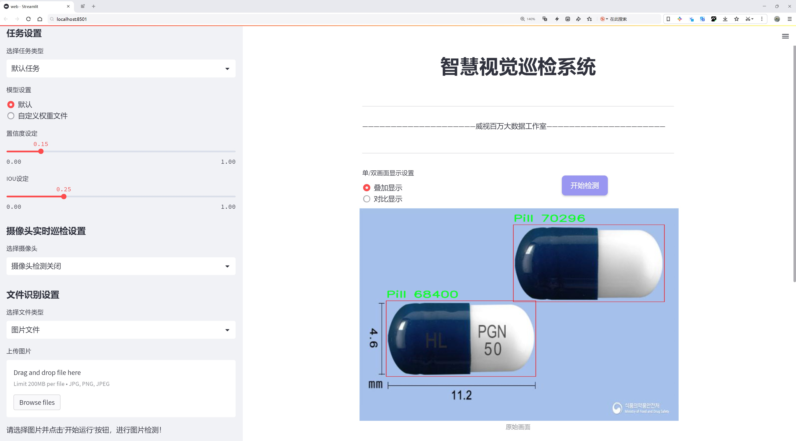
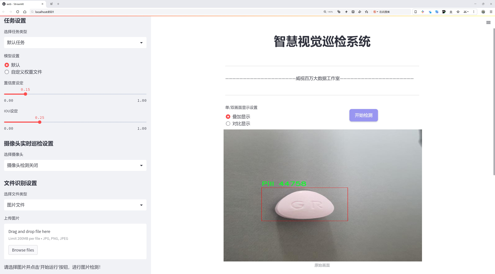
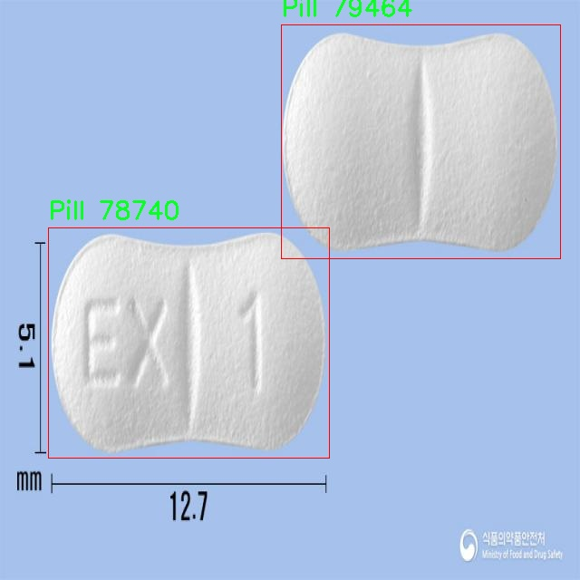
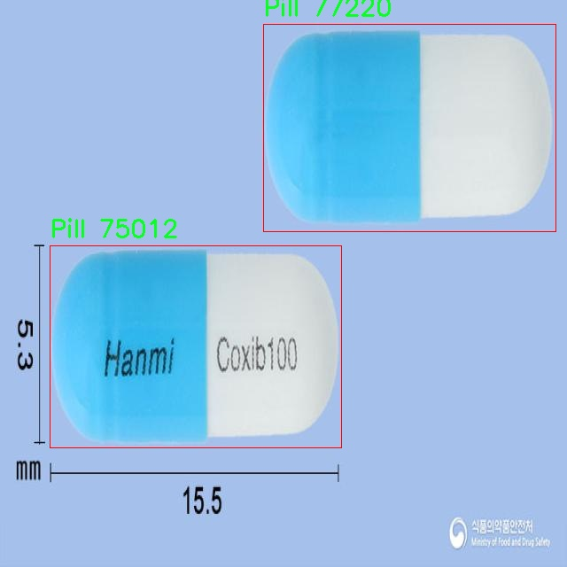
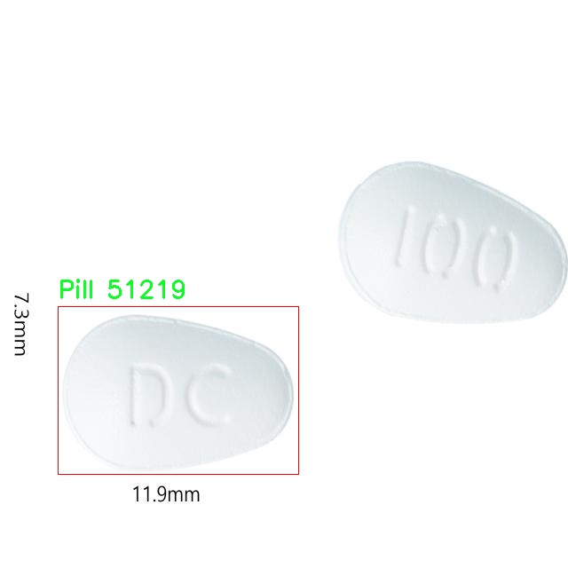
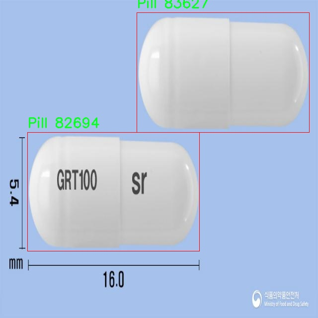
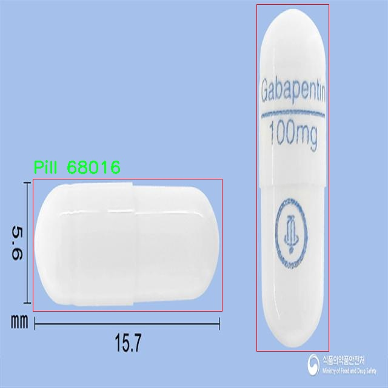

# 药物识别与分类检测系统源码分享
 # [一条龙教学YOLOV8标注好的数据集一键训练_70+全套改进创新点发刊_Web前端展示]

### 1.研究背景与意义

项目参考[AAAI Association for the Advancement of Artificial Intelligence](https://gitee.com/qunmasj/projects)

项目来源[AACV Association for the Advancement of Computer Vision](https://kdocs.cn/l/cszuIiCKVNis)

研究背景与意义

随着全球人口的不断增长和老龄化加速，药物的使用频率和种类日益增加，药物管理和识别的需求愈发显著。药物识别与分类在医疗健康、药品监管以及公共安全等领域中扮演着至关重要的角色。传统的药物识别方法多依赖于人工检查，不仅效率低下，而且容易受到人为因素的影响，导致识别错误或漏检。因此，利用先进的计算机视觉技术进行药物识别与分类，成为了提升药物管理效率和准确性的有效途径。

近年来，深度学习技术的迅猛发展为图像识别领域带来了革命性的变化。YOLO（You Only Look Once）系列模型因其快速的实时检测能力和高精度的特性，广泛应用于物体检测任务中。YOLOv8作为该系列的最新版本，进一步优化了模型的结构和算法，提升了检测精度和速度，适合于复杂环境下的药物识别与分类任务。然而，尽管YOLOv8在物体检测方面表现出色，但在特定领域如药物识别中，仍需针对数据集的特性进行改进和调整，以实现更高的识别准确率。

本研究旨在基于改进的YOLOv8模型，构建一个高效的药物识别与分类系统。我们将利用832张包含药物和药丸的图像数据集，进行模型训练和测试。该数据集涵盖了两大类药物，分别为“Medicine”和“Pill”，为模型的训练提供了良好的基础。通过对YOLOv8模型的改进，我们将重点关注以下几个方面：一是数据增强技术的应用，以提高模型对不同药物形态和环境的适应能力；二是模型参数的优化，以提升检测速度和准确性；三是引入多尺度特征融合策略，以增强模型对小型药物物体的识别能力。

本研究的意义不仅在于提升药物识别的技术水平，更在于为药物管理提供智能化解决方案。通过构建一个高效的药物识别与分类系统，能够有效减少人工检查的工作量，提高药物管理的效率和准确性。此外，该系统还可以为药品监管部门提供数据支持，帮助其更好地监控市场上的药物质量和安全性，进而保护公众健康。

总之，基于改进YOLOv8的药物识别与分类系统的研究，具有重要的理论价值和实际应用意义。它不仅为深度学习在医疗领域的应用提供了新的思路，也为未来药物管理的智能化发展奠定了基础。通过本研究，我们期望能够推动药物识别技术的进步，为医疗健康行业的数字化转型贡献力量。

### 2.图片演示







##### 注意：由于此博客编辑较早，上面“2.图片演示”和“3.视频演示”展示的系统图片或者视频可能为老版本，新版本在老版本的基础上升级如下：（实际效果以升级的新版本为准）

  （1）适配了YOLOV8的“目标检测”模型和“实例分割”模型，通过加载相应的权重（.pt）文件即可自适应加载模型。

  （2）支持“图片识别”、“视频识别”、“摄像头实时识别”三种识别模式。

  （3）支持“图片识别”、“视频识别”、“摄像头实时识别”三种识别结果保存导出，解决手动导出（容易卡顿出现爆内存）存在的问题，识别完自动保存结果并导出到tempDir中。

  （4）支持Web前端系统中的标题、背景图等自定义修改，后面提供修改教程。

  另外本项目提供训练的数据集和训练教程,暂不提供权重文件（best.pt）,需要您按照教程进行训练后实现图片演示和Web前端界面演示的效果。

### 3.视频演示

[3.1 视频演示](https://www.bilibili.com/video/BV11t4uefEKP/)

### 4.数据集信息展示

##### 4.1 本项目数据集详细数据（类别数＆类别名）

nc: 1
names: ['Pill']


##### 4.2 本项目数据集信息介绍

数据集信息展示

在现代医学和药物管理领域，药物识别与分类的准确性和效率显得尤为重要。为此，我们构建了一个名为“AI Drug Analysis Service”的数据集，旨在为改进YOLOv8的药物识别与分类系统提供强有力的支持。该数据集专注于单一类别的药物，即“Pill”，以确保系统在特定领域内的高效性和准确性。

“AI Drug Analysis Service”数据集包含大量经过精心挑选和标注的药物图像，这些图像涵盖了不同形状、颜色和大小的药丸。这种多样性不仅有助于训练模型识别各种药物的外观特征，还能增强模型在实际应用中的泛化能力。每一张图像都经过专业人员的审核和标注，确保数据的准确性和可靠性。数据集的构建过程中，我们注重图像的质量和多样性，以便模型能够学习到丰富的特征信息。

该数据集的类别数量为1，具体类别为“Pill”。虽然类别数量较少，但我们相信，专注于这一单一类别能够使模型在药物识别的任务上达到更高的精度。药物的外观特征往往受到多种因素的影响，包括生产厂家、药物成分及其剂型等，因此在这一类别下，我们尽可能地收集了多种不同的药物样本，以确保模型能够识别出同一类别下的不同变体。

在数据集的使用过程中，研究人员可以通过YOLOv8模型进行训练，利用其先进的深度学习算法来提取图像特征。YOLOv8作为一种高效的目标检测算法，能够实时处理图像数据，快速识别和分类药物。这一特性使得我们的数据集在实际应用中具有重要的价值，尤其是在需要快速响应的医疗环境中。

为了进一步提升模型的性能，我们在数据集的构建过程中还考虑了数据增强技术。通过对原始图像进行旋转、缩放、裁剪和颜色调整等处理，我们能够生成更多的训练样本。这不仅丰富了数据集的内容，还提高了模型的鲁棒性，使其在面对不同的输入条件时依然能够保持较高的识别率。

总之，“AI Drug Analysis Service”数据集为药物识别与分类系统的研究提供了坚实的基础。通过对单一类别“Pill”的深入挖掘和分析，我们希望能够推动药物识别技术的发展，提升其在实际应用中的有效性和可靠性。随着深度学习技术的不断进步，我们期待这一数据集能够为未来的药物管理和医疗服务带来更多的创新和突破。











### 5.全套项目环境部署视频教程（零基础手把手教学）

[5.1 环境部署教程链接（零基础手把手教学）](https://www.ixigua.com/7404473917358506534?logTag=c807d0cbc21c0ef59de5)


[5.2 安装Python虚拟环境创建和依赖库安装视频教程链接（零基础手把手教学）](https://www.ixigua.com/7404474678003106304?logTag=1f1041108cd1f708b01a)

### 6.手把手YOLOV8训练视频教程（零基础小白有手就能学会）

[6.1 手把手YOLOV8训练视频教程（零基础小白有手就能学会）](https://www.ixigua.com/7404477157818401292?logTag=d31a2dfd1983c9668658)

### 7.70+种全套YOLOV8创新点代码加载调参视频教程（一键加载写好的改进模型的配置文件）

[7.1 70+种全套YOLOV8创新点代码加载调参视频教程（一键加载写好的改进模型的配置文件）](https://www.ixigua.com/7404478314661806627?logTag=29066f8288e3f4eea3a4)

### 8.70+种全套YOLOV8创新点原理讲解（非科班也可以轻松写刊发刊，V10版本正在科研待更新）

由于篇幅限制，每个创新点的具体原理讲解就不一一展开，具体见下列网址中的创新点对应子项目的技术原理博客网址【Blog】：


[8.1 70+种全套YOLOV8创新点原理讲解链接](https://gitee.com/qunmasj/good)

### 9.系统功能展示（检测对象为举例，实际内容以本项目数据集为准）

图9.1.系统支持检测结果表格显示

  图9.2.系统支持置信度和IOU阈值手动调节

  图9.3.系统支持自定义加载权重文件best.pt(需要你通过步骤5中训练获得)

  图9.4.系统支持摄像头实时识别

  图9.5.系统支持图片识别

  图9.6.系统支持视频识别

  图9.7.系统支持识别结果文件自动保存

  图9.8.系统支持Excel导出检测结果数据


### 10.原始YOLOV8算法原理

原始YOLOv8算法原理

YOLOv8作为目标检测领域的最新进展，展现了深度学习技术在计算机视觉中的巨大潜力。其设计理念源于对实时性和准确性的双重追求，旨在通过一系列创新的网络结构和算法优化，提升目标检测的效率和精度。YOLOv8的整体架构可以分为输入层、主干网络、颈部网络和头部网络四个主要部分，每一部分都在整体性能中扮演着不可或缺的角色。

在输入层，YOLOv8首先对输入图像进行缩放，以适应模型的要求。这一过程不仅保证了图像的统一性，还为后续的特征提取奠定了基础。缩放后的图像通过主干网络进行处理，主干网络的设计借鉴了YOLO系列之前的成功经验，同时引入了新的结构以增强特征提取能力。主干网络采用了卷积操作，通过下采样的方式逐步提取图像中的特征信息。每个卷积层都配备了批归一化和SiLUR激活函数，这不仅提高了模型的收敛速度，还增强了网络的非线性表达能力。

在主干网络的核心部分，YOLOv8引入了C2f块，这一模块的设计灵感来源于YOLOv7中的E-ELAN结构。C2f块通过跨层分支连接的方式，促进了梯度流的传递，从而有效地改善了模型的检测性能。这种设计使得不同层次的特征能够更好地融合，提升了模型对复杂场景的适应能力。主干网络的末尾，SPPFl块通过三个最大池化层的组合，进一步增强了模型对多尺度特征的处理能力。这一设计使得YOLOv8能够在面对不同大小的目标时，依然保持较高的检测精度。

接下来，颈部网络的设计同样至关重要。YOLOv8采用了FPNS（Feature Pyramid Network）和PAN（Path Aggregation Network）结构，以实现不同尺度特征图的信息融合。这一过程不仅提高了特征的表达能力，还为后续的目标检测提供了更加丰富的上下文信息。通过这种多尺度特征融合，YOLOv8能够更好地捕捉到目标的细节，提升了对小目标的检测能力。

在头部网络部分，YOLOv8采用了解耦的检测头结构。这一创新的设计通过两个并行的卷积分支，分别计算回归和类别的损失，使得模型在目标定位和分类任务中能够更为精确。解耦结构的引入，不仅提高了模型的灵活性，还有效降低了计算复杂度。YOLOv8在损失函数的设计上也进行了优化，采用了变焦损失来计算分类损失，同时引入数据平均保真度损失和完美交并比损失，以提升边界框的回归精度。这种多元化的损失计算方式，使得YOLOv8在目标检测任务中表现出色。

此外，YOLOv8的轻量化设计理念也值得关注。针对不同应用场景，YOLOv8提供了多个版本，如YOLOv8n、YOLOv8s和YOLOv8m等，以满足不同计算资源和实时性需求的用户。这种灵活的版本选择，使得YOLOv8能够在移动设备和边缘计算环境中广泛应用，进一步推动了目标检测技术的普及。

总的来说，YOLOv8通过一系列创新的网络结构和算法优化，成功地在目标检测领域树立了新的标杆。其主干网络的特征提取能力、颈部网络的多尺度特征融合、头部网络的解耦检测机制，以及灵活的版本设计，均为YOLOv8的卓越性能提供了有力支撑。随着YOLOv8的不断发展和应用，未来的目标检测技术将更加高效、准确，为各类智能应用提供更为坚实的基础。


### 11.项目核心源码讲解（再也不用担心看不懂代码逻辑）

#### 11.1 70+种YOLOv8算法改进源码大全和调试加载训练教程（非必要）\ultralytics\engine\model.py

以下是经过简化和注释的核心代码部分，保留了YOLO模型的基本结构和功能：

```python
import torch
import inspect
import sys
from pathlib import Path
from typing import Union

# 导入必要的模块和工具
from ultralytics.nn.tasks import nn
from ultralytics.utils import callbacks, checks, yaml_load

class Model(nn.Module):
    """
    YOLO模型的基础类，统一所有模型的API。

    属性:
        predictor: 预测器对象
        model: 模型对象
        task: 模型任务类型
        ckpt: 从*.pt文件加载的检查点对象
        cfg: 从*.yaml文件加载的模型配置
        overrides: 对训练器对象的覆盖参数
    """

    def __init__(self, model: Union[str, Path] = 'yolov8n.pt', task=None) -> None:
        """
        初始化YOLO模型。

        参数:
            model: 要加载或创建的模型路径或名称，默认为'yolov8n.pt'
            task: YOLO模型的任务类型，默认为None
        """
        super().__init__()
        self.predictor = None  # 预测器
        self.model = None  # 模型对象
        self.task = task  # 任务类型
        model = str(model).strip()  # 去除空格

        # 检查模型类型并加载
        if Path(model).suffix in ('.yaml', '.yml'):
            self._new(model, task)  # 从配置文件创建新模型
        else:
            self._load(model, task)  # 从权重文件加载模型

    def _new(self, cfg: str, task=None):
        """
        从配置文件初始化新模型。

        参数:
            cfg: 模型配置文件
            task: 模型任务
        """
        cfg_dict = yaml_load(cfg)  # 加载yaml配置
        self.task = task or cfg_dict.get('task')  # 获取任务类型
        self.model = self._smart_load('model')(cfg_dict)  # 创建模型

    def _load(self, weights: str, task=None):
        """
        从权重文件加载模型。

        参数:
            weights: 模型权重文件路径
            task: 模型任务
        """
        self.model = torch.load(weights)  # 加载权重
        self.task = task or self.model.args.get('task')  # 获取任务类型

    def predict(self, source=None, **kwargs):
        """
        使用YOLO模型进行预测。

        参数:
            source: 预测的输入源
            **kwargs: 其他参数
        """
        if source is None:
            source = 'default_source'  # 默认输入源
        # 调用预测器进行预测
        return self.predictor.predict(source=source, **kwargs)

    def train(self, **kwargs):
        """
        在给定数据集上训练模型。

        参数:
            **kwargs: 训练配置参数
        """
        # 检查模型是否为PyTorch模型
        if not isinstance(self.model, nn.Module):
            raise TypeError("模型必须是PyTorch模型")
        # 创建训练器并开始训练
        self.trainer = self._smart_load('trainer')(self.model, **kwargs)
        self.trainer.train()

    def _smart_load(self, key):
        """根据任务类型加载模型、训练器或预测器。"""
        try:
            return self.task_map[self.task][key]
        except KeyError:
            raise NotImplementedError(f"任务'{self.task}'不支持'{key}'模式。")

    @property
    def task_map(self):
        """返回任务到模型、训练器和预测器类的映射。"""
        raise NotImplementedError('请为您的模型提供任务映射！')
```

### 代码注释说明：
1. **Model类**：这是YOLO模型的基础类，包含了模型的初始化、加载、预测和训练等基本功能。
2. **__init__方法**：初始化模型时，接受模型路径和任务类型，检查模型类型并调用相应的方法进行加载。
3. **_new方法**：从配置文件创建新模型，加载yaml配置并初始化模型。
4. **_load方法**：从权重文件加载模型，获取任务类型。
5. **predict方法**：进行预测，接受输入源并调用预测器进行预测。
6. **train方法**：训练模型，检查模型类型并创建训练器进行训练。
7. **_smart_load方法**：根据任务类型加载相应的组件。
8. **task_map属性**：提供任务到模型、训练器和预测器的映射，具体实现需要子类提供。

以上代码保留了YOLO模型的核心功能，去除了冗余部分，并添加了详细的中文注释以便理解。

这个文件是Ultralytics YOLO（You Only Look Once）模型的核心实现部分，主要定义了一个名为`Model`的类，用于统一管理和操作YOLO模型。该类继承自PyTorch的`nn.Module`，因此可以利用PyTorch的所有功能。

在初始化`Model`类时，可以传入模型文件的路径或名称（默认为'yolov8n.pt'）以及任务类型。类的属性包括预测器、模型对象、训练器、任务类型、检查点、配置文件路径、覆盖参数和指标等。构造函数中首先检查模型是否来自Ultralytics HUB或Triton Server，然后根据文件后缀加载或创建新的YOLO模型。

`Model`类提供了多种方法来进行模型的预测、训练、验证和导出等操作。`__call__`方法使得该类的实例可以像函数一样被调用，实际上是调用了`predict`方法来进行目标检测。`predict`方法接受图像源、流式预测标志和其他参数，返回预测结果。

在模型加载方面，`_new`和`_load`方法分别用于从配置文件和权重文件中初始化模型。`_check_is_pytorch_model`方法用于检查加载的模型是否为PyTorch模型，确保后续操作的有效性。

模型的重置、信息日志、融合层、追踪和验证等功能也被封装在类中。`train`方法用于在给定数据集上训练模型，支持自定义训练器。`tune`方法则用于超参数调优，支持使用Ray Tune。

此外，类中还定义了一些静态方法，如`is_hub_model`和`is_triton_model`，用于判断模型的来源。还有一些属性方法，例如`names`、`device`和`transforms`，用于获取模型的相关信息。

总的来说，这个文件提供了YOLO模型的完整接口，方便用户进行模型的加载、训练、预测和评估等操作，是YOLOv8算法实现的重要组成部分。

#### 11.2 ui.py

```python
import sys
import subprocess

def run_script(script_path):
    """
    使用当前 Python 环境运行指定的脚本。

    Args:
        script_path (str): 要运行的脚本路径

    Returns:
        None
    """
    # 获取当前 Python 解释器的路径
    python_path = sys.executable

    # 构建运行命令
    command = f'"{python_path}" -m streamlit run "{script_path}"'

    # 执行命令
    result = subprocess.run(command, shell=True)
    if result.returncode != 0:
        print("脚本运行出错。")


# 实例化并运行应用
if __name__ == "__main__":
    # 指定您的脚本路径
    script_path = "web.py"  # 这里可以直接指定脚本名称

    # 运行脚本
    run_script(script_path)
```

### 代码注释

1. **导入模块**：
   - `import sys`：导入系统相关的模块，用于获取当前 Python 解释器的路径。
   - `import subprocess`：导入子进程模块，用于在 Python 中执行外部命令。

2. **定义函数 `run_script`**：
   - 该函数接受一个参数 `script_path`，表示要运行的 Python 脚本的路径。
   - 使用 `sys.executable` 获取当前 Python 解释器的路径，以确保脚本在正确的环境中运行。
   - 构建命令字符串 `command`，使用 `streamlit` 模块运行指定的脚本。
   - 使用 `subprocess.run` 执行构建的命令，并将 `shell=True` 传递给它，以便在 shell 中运行命令。
   - 检查命令的返回码，如果不为 0，表示脚本运行出错，打印错误信息。

3. **主程序入口**：
   - `if __name__ == "__main__":`：确保该代码块仅在直接运行脚本时执行，而不是在被导入时执行。
   - 指定要运行的脚本路径 `script_path`，这里直接使用脚本名称 `"web.py"`。
   - 调用 `run_script` 函数，传入脚本路径以执行该脚本。

这个程序文件名为 `ui.py`，其主要功能是通过当前的 Python 环境运行一个指定的脚本，具体是使用 Streamlit 来启动一个 Web 应用。

程序首先导入了必要的模块，包括 `sys`、`os` 和 `subprocess`，这些模块分别用于访问 Python 解释器的信息、处理文件路径和执行外部命令。此外，还从 `QtFusion.path` 模块中导入了 `abs_path` 函数，用于获取脚本的绝对路径。

在 `run_script` 函数中，程序接受一个参数 `script_path`，这是要运行的脚本的路径。函数首先获取当前 Python 解释器的路径，并将其存储在 `python_path` 变量中。接着，构建一个命令字符串，该命令使用当前的 Python 解释器和 Streamlit 模块来运行指定的脚本。命令的格式为 `"{python_path}" -m streamlit run "{script_path}"`。

随后，程序使用 `subprocess.run` 方法执行这个命令。该方法的 `shell=True` 参数允许在 shell 中执行命令。如果命令执行后返回的状态码不为零，表示脚本运行出错，程序会打印出相应的错误信息。

在文件的最后部分，使用 `if __name__ == "__main__":` 语句来确保当该文件作为主程序运行时才会执行以下代码。程序指定了要运行的脚本路径，这里使用 `abs_path("web.py")` 来获取 `web.py` 脚本的绝对路径。最后，调用 `run_script` 函数来运行这个脚本。

总体来说，这个程序的目的是方便地通过当前的 Python 环境启动一个 Streamlit Web 应用，确保用户能够以简单的方式运行指定的 Python 脚本。

#### 11.3 code\ultralytics\data\utils.py

以下是代码中最核心的部分，并附上详细的中文注释：

```python
import os
import hashlib
from pathlib import Path
from PIL import Image, ImageOps
import numpy as np

IMG_FORMATS = "bmp", "jpeg", "jpg", "png", "tif", "tiff"  # 支持的图像格式

def img2label_paths(img_paths):
    """根据图像路径定义标签路径。"""
    sa, sb = f"{os.sep}images{os.sep}", f"{os.sep}labels{os.sep}"  # 图像和标签的子字符串
    return [sb.join(x.rsplit(sa, 1)).rsplit(".", 1)[0] + ".txt" for x in img_paths]

def get_hash(paths):
    """返回路径列表（文件或目录）的单个哈希值。"""
    size = sum(os.path.getsize(p) for p in paths if os.path.exists(p))  # 计算文件大小
    h = hashlib.sha256(str(size).encode())  # 基于大小生成哈希
    h.update("".join(paths).encode())  # 基于路径更新哈希
    return h.hexdigest()  # 返回哈希值

def exif_size(img: Image.Image):
    """返回经过EXIF校正的PIL图像大小。"""
    s = img.size  # (宽度, 高度)
    if img.format == "JPEG":  # 仅支持JPEG格式
        exif = img.getexif()  # 获取EXIF信息
        if exif:
            rotation = exif.get(274, None)  # 获取方向标签
            if rotation in [6, 8]:  # 处理旋转
                s = s[1], s[0]  # 交换宽高
    return s

def verify_image(im_file):
    """验证单个图像文件的完整性。"""
    nf, nc, msg = 0, 0, ""  # 统计信息
    try:
        im = Image.open(im_file)  # 打开图像
        im.verify()  # 验证图像
        shape = exif_size(im)  # 获取图像大小
        assert (shape[0] > 9) & (shape[1] > 9), f"图像大小 {shape} <10 像素"  # 确保图像尺寸有效
        assert im.format.lower() in IMG_FORMATS, f"无效的图像格式 {im.format}"  # 检查格式
        nf = 1  # 图像有效
    except Exception as e:
        nc = 1  # 图像损坏
        msg = f"警告 ⚠️ {im_file}: 忽略损坏的图像: {e}"
    return im_file, nf, nc, msg  # 返回验证结果

def verify_image_label(im_file, lb_file):
    """验证图像-标签对的完整性。"""
    nf, nc, ne, msg = 0, 0, 0, ""  # 统计信息
    try:
        # 验证图像
        im = Image.open(im_file)
        im.verify()  # 验证图像
        shape = exif_size(im)  # 获取图像大小
        assert (shape[0] > 9) & (shape[1] > 9), f"图像大小 {shape} <10 像素"  # 确保图像尺寸有效
        nf = 1  # 图像有效

        # 验证标签
        if os.path.isfile(lb_file):
            nf = 1  # 标签存在
            with open(lb_file) as f:
                lb = [x.split() for x in f.read().strip().splitlines() if len(x)]  # 读取标签
                lb = np.array(lb, dtype=np.float32)  # 转换为numpy数组
            nl = len(lb)
            if nl == 0:
                ne = 1  # 标签为空
        else:
            msg = f"警告 ⚠️ {im_file}: 标签缺失"
            nf = 0  # 标签缺失
        return im_file, lb, shape, nf, ne, msg  # 返回验证结果
    except Exception as e:
        msg = f"警告 ⚠️ {im_file}: 忽略损坏的图像/标签: {e}"
        return None, None, None, 0, 0, msg  # 返回错误信息

def check_det_dataset(dataset):
    """
    检查检测数据集的完整性和可用性。
    如果数据集未找到，则尝试下载。
    """
    # 这里省略具体实现，主要是验证数据集的结构和文件完整性
    pass

# 其他函数和类的实现省略，核心逻辑在于图像和标签的验证，以及数据集的检查。
```

### 代码核心部分说明：
1. **图像和标签路径转换**：`img2label_paths` 函数根据图像路径生成对应的标签路径。
2. **哈希生成**：`get_hash` 函数用于生成文件或目录的哈希值，确保数据的完整性。
3. **EXIF校正**：`exif_size` 函数获取图像的实际尺寸，考虑了EXIF信息中的旋转。
4. **图像验证**：`verify_image` 和 `verify_image_label` 函数用于验证图像和标签的完整性，确保图像格式和尺寸有效。
5. **数据集检查**：`check_det_dataset` 函数用于检查数据集的完整性和可用性，如果数据集缺失则尝试下载。

这些核心功能确保了数据集的有效性和完整性，是构建计算机视觉模型的基础。

这个程序文件 `utils.py` 是 Ultralytics YOLO 项目的一部分，主要用于处理与数据集相关的各种功能。它包含了图像和标签的验证、数据集的下载和解析、图像的处理以及一些辅助函数。

首先，文件导入了多个必要的库，包括标准库和第三方库，例如 `PIL`、`cv2` 和 `numpy`，这些库提供了图像处理和数据操作的功能。接着，定义了一些常量，例如支持的图像和视频格式，以及全局的内存固定设置。

在函数部分，`img2label_paths` 函数根据图像路径生成对应的标签路径。`get_hash` 函数计算给定路径列表的哈希值，用于验证文件的完整性。`exif_size` 函数用于获取图像的实际尺寸，考虑到图像的 EXIF 信息。

`verify_image` 和 `verify_image_label` 函数分别用于验证单个图像和图像-标签对的有效性。这些函数会检查图像格式、尺寸、损坏情况，并对标签文件进行相应的验证，确保它们符合预期的格式和内容。

`polygon2mask` 和 `polygons2masks` 函数用于将多边形转换为二进制掩码，适用于图像分割任务。`find_dataset_yaml` 函数用于查找与数据集相关的 YAML 文件，确保数据集的格式正确。

`check_det_dataset` 和 `check_cls_dataset` 函数分别用于检查检测和分类数据集的有效性，支持自动下载缺失的数据集，并解析其 YAML 文件，确保必要的字段存在且正确。

`HUBDatasetStats` 类用于生成 HUB 数据集的 JSON 文件和相关目录。它支持自动下载数据集，并提供方法来处理图像和生成统计信息。

最后，`compress_one_image` 函数用于压缩单个图像文件，以减少其大小，同时保持其长宽比和质量。`autosplit` 函数用于自动将数据集划分为训练、验证和测试集，并将结果保存到文本文件中。

整体而言，这个文件提供了一系列功能强大的工具，帮助用户管理和处理数据集，确保数据的有效性和可用性，支持各种计算机视觉任务。

#### 11.4 code\ultralytics\models\yolo\__init__.py

以下是代码中最核心的部分，并附上详细的中文注释：

```python
# 导入Ultralytics YOLO模型中的分类、检测、旋转边界框、姿态估计和分割功能
from ultralytics.models.yolo import classify, detect, obb, pose, segment

# 从当前模块导入YOLO类
from .model import YOLO

# 定义当前模块的公开接口，包含分类、分割、检测、姿态估计、旋转边界框和YOLO类
__all__ = "classify", "segment", "detect", "pose", "obb", "YOLO"
```

### 注释说明：
1. **导入模块**：
   - `from ultralytics.models.yolo import classify, detect, obb, pose, segment`：从Ultralytics的YOLO模型中导入多个功能模块，包括分类（classify）、检测（detect）、旋转边界框（obb）、姿态估计（pose）和分割（segment）。这些模块是YOLO模型的核心功能，用于不同的计算机视觉任务。

2. **导入YOLO类**：
   - `from .model import YOLO`：从当前目录下的`model`模块中导入YOLO类。这个类通常用于创建YOLO模型的实例，进行训练或推理。

3. **定义公开接口**：
   - `__all__ = "classify", "segment", "detect", "pose", "obb", "YOLO"`：定义当前模块的公开接口，表示当使用`from module import *`时，只有这些名称会被导入。这有助于控制模块的可见性，避免不必要的名称冲突。

这个程序文件是Ultralytics YOLO模型的初始化文件，文件名为`__init__.py`，它的主要作用是定义该模块的公共接口。首先，文件中包含了一条版权声明，表明该代码遵循AGPL-3.0许可证。

接下来，文件从`ultralytics.models.yolo`模块中导入了多个功能模块，包括`classify`（分类）、`detect`（检测）、`obb`（方向边界框）、`pose`（姿态估计）和`segment`（分割）。这些模块分别实现了YOLO模型的不同功能，用户可以根据需要调用相应的模块来完成特定的任务。

此外，文件还从当前包中导入了`YOLO`类，这个类可能是YOLO模型的核心实现，提供了模型的构建和推理功能。

最后，`__all__`变量被定义为一个元组，包含了所有希望被导出的模块和类的名称。这意味着当使用`from ultralytics.models.yolo import *`语句时，只会导入`classify`、`segment`、`detect`、`pose`、`obb`和`YOLO`这几个名称，从而控制了模块的命名空间，避免不必要的名称冲突。

总体来说，这个文件的结构简单明了，主要用于组织和导出YOLO模型相关的功能，使得用户能够方便地使用这些功能。

#### 11.5 train.py

以下是代码中最核心的部分，并附上详细的中文注释：

```python
class DetectionTrainer(BaseTrainer):
    """
    DetectionTrainer类，继承自BaseTrainer类，用于基于检测模型的训练。
    """

    def build_dataset(self, img_path, mode="train", batch=None):
        """
        构建YOLO数据集。

        参数:
            img_path (str): 包含图像的文件夹路径。
            mode (str): 模式，`train`表示训练模式，`val`表示验证模式，用户可以为每种模式自定义不同的增强。
            batch (int, optional): 批次大小，仅用于`rect`模式。默认为None。
        """
        gs = max(int(de_parallel(self.model).stride.max() if self.model else 0), 32)  # 获取模型的最大步幅
        return build_yolo_dataset(self.args, img_path, batch, self.data, mode=mode, rect=mode == "val", stride=gs)

    def get_dataloader(self, dataset_path, batch_size=16, rank=0, mode="train"):
        """构造并返回数据加载器。"""
        assert mode in ["train", "val"]  # 确保模式是训练或验证
        with torch_distributed_zero_first(rank):  # 如果使用分布式数据并行，确保数据集只初始化一次
            dataset = self.build_dataset(dataset_path, mode, batch_size)  # 构建数据集
        shuffle = mode == "train"  # 训练模式下打乱数据
        if getattr(dataset, "rect", False) and shuffle:
            LOGGER.warning("WARNING ⚠️ 'rect=True'与DataLoader的shuffle不兼容，设置shuffle=False")
            shuffle = False  # 如果使用rect模式，禁用打乱
        workers = self.args.workers if mode == "train" else self.args.workers * 2  # 根据模式设置工作线程数
        return build_dataloader(dataset, batch_size, workers, shuffle, rank)  # 返回数据加载器

    def preprocess_batch(self, batch):
        """对一批图像进行预处理，包括缩放和转换为浮点数。"""
        batch["img"] = batch["img"].to(self.device, non_blocking=True).float() / 255  # 将图像转换为浮点数并归一化
        if self.args.multi_scale:  # 如果启用多尺度
            imgs = batch["img"]
            sz = (
                random.randrange(self.args.imgsz * 0.5, self.args.imgsz * 1.5 + self.stride)
                // self.stride
                * self.stride
            )  # 随机选择一个尺寸
            sf = sz / max(imgs.shape[2:])  # 计算缩放因子
            if sf != 1:
                ns = [
                    math.ceil(x * sf / self.stride) * self.stride for x in imgs.shape[2:]
                ]  # 计算新的形状
                imgs = nn.functional.interpolate(imgs, size=ns, mode="bilinear", align_corners=False)  # 进行插值
            batch["img"] = imgs  # 更新图像
        return batch

    def set_model_attributes(self):
        """设置模型的属性，包括类别数量和名称。"""
        self.model.nc = self.data["nc"]  # 将类别数量附加到模型
        self.model.names = self.data["names"]  # 将类别名称附加到模型
        self.model.args = self.args  # 将超参数附加到模型

    def get_model(self, cfg=None, weights=None, verbose=True):
        """返回YOLO检测模型。"""
        model = DetectionModel(cfg, nc=self.data["nc"], verbose=verbose and RANK == -1)  # 创建检测模型
        if weights:
            model.load(weights)  # 加载权重
        return model

    def get_validator(self):
        """返回YOLO模型验证器。"""
        self.loss_names = "box_loss", "cls_loss", "dfl_loss"  # 定义损失名称
        return yolo.detect.DetectionValidator(
            self.test_loader, save_dir=self.save_dir, args=copy(self.args), _callbacks=self.callbacks
        )

    def label_loss_items(self, loss_items=None, prefix="train"):
        """
        返回带标签的训练损失项字典。

        对于分类不需要，但对于分割和检测是必要的。
        """
        keys = [f"{prefix}/{x}" for x in self.loss_names]  # 创建损失项的键
        if loss_items is not None:
            loss_items = [round(float(x), 5) for x in loss_items]  # 将张量转换为5位小数的浮点数
            return dict(zip(keys, loss_items))  # 返回键值对字典
        else:
            return keys  # 返回键列表

    def progress_string(self):
        """返回格式化的训练进度字符串，包括轮次、GPU内存、损失、实例和大小。"""
        return ("\n" + "%11s" * (4 + len(self.loss_names))) % (
            "Epoch",
            "GPU_mem",
            *self.loss_names,
            "Instances",
            "Size",
        )

    def plot_training_samples(self, batch, ni):
        """绘制带有注释的训练样本。"""
        plot_images(
            images=batch["img"],
            batch_idx=batch["batch_idx"],
            cls=batch["cls"].squeeze(-1),
            bboxes=batch["bboxes"],
            paths=batch["im_file"],
            fname=self.save_dir / f"train_batch{ni}.jpg",
            on_plot=self.on_plot,
        )

    def plot_metrics(self):
        """从CSV文件中绘制指标。"""
        plot_results(file=self.csv, on_plot=self.on_plot)  # 保存结果图像

    def plot_training_labels(self):
        """创建YOLO模型的标记训练图。"""
        boxes = np.concatenate([lb["bboxes"] for lb in self.train_loader.dataset.labels], 0)  # 合并所有边界框
        cls = np.concatenate([lb["cls"] for lb in self.train_loader.dataset.labels], 0)  # 合并所有类别
        plot_labels(boxes, cls.squeeze(), names=self.data["names"], save_dir=self.save_dir, on_plot=self.on_plot)  # 绘制标签
```

以上代码是YOLO检测模型训练的核心部分，包含了数据集构建、数据加载、图像预处理、模型设置、损失计算、训练进度显示以及绘图等功能。每个方法都有详细的中文注释，便于理解其功能和实现。

这个程序文件 `train.py` 是一个用于训练 YOLO（You Only Look Once）目标检测模型的实现，继承自 `BaseTrainer` 类。程序中包含了多个方法，主要用于构建数据集、获取数据加载器、预处理图像、设置模型属性、获取模型、验证模型、记录损失、显示训练进度、绘制训练样本和绘制训练指标等。

首先，`DetectionTrainer` 类通过 `build_dataset` 方法构建 YOLO 数据集。该方法接收图像路径、模式（训练或验证）和批量大小作为参数，使用 `build_yolo_dataset` 函数生成数据集。这里的 `gs` 是根据模型的最大步幅计算的，确保数据集的生成符合模型的要求。

接下来，`get_dataloader` 方法用于构建并返回数据加载器。它会根据传入的模式（训练或验证）选择相应的数据集，并设置是否打乱数据。特别地，如果数据集的 `rect` 属性为真且模式为训练，则会发出警告，因为这两者不兼容。

在处理每个批次的图像时，`preprocess_batch` 方法会将图像转换为浮点数并进行归一化。如果启用了多尺度训练，它还会随机调整图像的大小，以增强模型的鲁棒性。

`set_model_attributes` 方法用于设置模型的属性，包括类别数量和类别名称等，以确保模型能够正确处理数据集中的信息。

通过 `get_model` 方法，可以返回一个 YOLO 检测模型，并可选择加载预训练权重。`get_validator` 方法则返回一个用于验证模型的 `DetectionValidator` 实例，以便在训练过程中评估模型的性能。

在训练过程中，`label_loss_items` 方法会返回一个包含训练损失项的字典，方便记录和分析模型的训练过程。`progress_string` 方法则格式化并返回训练进度的字符串，显示当前的训练轮次、GPU 内存使用情况、损失值、实例数量和图像大小等信息。

此外，`plot_training_samples` 方法用于绘制训练样本及其标注，便于可视化训练数据的质量。最后，`plot_metrics` 和 `plot_training_labels` 方法分别用于绘制训练过程中的指标和标注图，帮助分析模型的训练效果。

整体来看，这个文件实现了 YOLO 模型训练的核心功能，涵盖了数据处理、模型构建、训练监控和结果可视化等多个方面。

#### 11.6 70+种YOLOv8算法改进源码大全和调试加载训练教程（非必要）\ultralytics\models\yolo\segment\val.py

以下是代码中最核心的部分，并附上详细的中文注释：

```python
class SegmentationValidator(DetectionValidator):
    """
    SegmentationValidator类用于基于分割模型的验证，继承自DetectionValidator类。
    """

    def __init__(self, dataloader=None, save_dir=None, pbar=None, args=None, _callbacks=None):
        """初始化SegmentationValidator并将任务设置为'segment'，度量标准设置为SegmentMetrics。"""
        super().__init__(dataloader, save_dir, pbar, args, _callbacks)
        self.plot_masks = None  # 用于存储绘制的掩码
        self.process = None  # 掩码处理函数
        self.args.task = 'segment'  # 设置任务类型为分割
        self.metrics = SegmentMetrics(save_dir=self.save_dir, on_plot=self.on_plot)  # 初始化度量标准

    def preprocess(self, batch):
        """预处理批次，将掩码转换为浮点数并发送到设备。"""
        batch = super().preprocess(batch)  # 调用父类的预处理方法
        batch['masks'] = batch['masks'].to(self.device).float()  # 将掩码转移到设备并转换为浮点数
        return batch

    def postprocess(self, preds):
        """后处理YOLO预测，返回输出检测结果和原型。"""
        p = ops.non_max_suppression(preds[0],  # 进行非极大值抑制
                                    self.args.conf,
                                    self.args.iou,
                                    labels=self.lb,
                                    multi_label=True,
                                    agnostic=self.args.single_cls,
                                    max_det=self.args.max_det,
                                    nc=self.nc)
        proto = preds[1][-1] if len(preds[1]) == 3 else preds[1]  # 获取原型
        return p, proto  # 返回处理后的预测结果和原型

    def update_metrics(self, preds, batch):
        """更新度量标准。"""
        for si, (pred, proto) in enumerate(zip(preds[0], preds[1])):  # 遍历每个预测
            idx = batch['batch_idx'] == si  # 获取当前批次的索引
            cls = batch['cls'][idx]  # 获取当前批次的类别
            bbox = batch['bboxes'][idx]  # 获取当前批次的边界框
            nl, npr = cls.shape[0], pred.shape[0]  # 标签数量和预测数量
            shape = batch['ori_shape'][si]  # 获取原始图像的形状
            correct_masks = torch.zeros(npr, self.niou, dtype=torch.bool, device=self.device)  # 初始化正确掩码
            correct_bboxes = torch.zeros(npr, self.niou, dtype=torch.bool, device=self.device)  # 初始化正确边界框
            self.seen += 1  # 增加已处理的样本数量

            if npr == 0:  # 如果没有预测
                if nl:  # 如果有标签
                    self.stats.append((correct_bboxes, correct_masks, *torch.zeros((2, 0), device=self.device), cls.squeeze(-1)))
                continue  # 继续下一个循环

            # 处理掩码
            midx = [si] if self.args.overlap_mask else idx  # 根据重叠掩码的参数选择索引
            gt_masks = batch['masks'][midx]  # 获取真实掩码
            pred_masks = self.process(proto, pred[:, 6:], pred[:, :4], shape=batch['img'][si].shape[1:])  # 处理预测掩码

            # 处理边界框预测
            if self.args.single_cls:
                pred[:, 5] = 0  # 如果是单类检测，将类别设置为0
            predn = pred.clone()  # 克隆预测
            ops.scale_boxes(batch['img'][si].shape[1:], predn[:, :4], shape, ratio_pad=batch['ratio_pad'][si])  # 将预测边界框缩放到原始图像空间

            # 评估
            if nl:  # 如果有标签
                height, width = batch['img'].shape[2:]  # 获取图像的高度和宽度
                tbox = ops.xywh2xyxy(bbox) * torch.tensor((width, height, width, height), device=self.device)  # 转换标签边界框
                ops.scale_boxes(batch['img'][si].shape[1:], tbox, shape, ratio_pad=batch['ratio_pad'][si])  # 缩放标签边界框
                labelsn = torch.cat((cls, tbox), 1)  # 合并类别和边界框
                correct_bboxes = self._process_batch(predn, labelsn)  # 处理边界框
                correct_masks = self._process_batch(predn, labelsn, pred_masks, gt_masks, overlap=self.args.overlap_mask, masks=True)  # 处理掩码
                if self.args.plots:
                    self.confusion_matrix.process_batch(predn, labelsn)  # 更新混淆矩阵

            # 追加正确的掩码和边界框
            self.stats.append((correct_bboxes, correct_masks, pred[:, 4], pred[:, 5], cls.squeeze(-1)))

    def finalize_metrics(self, *args, **kwargs):
        """设置评估度量的速度和混淆矩阵。"""
        self.metrics.speed = self.speed  # 设置速度
        self.metrics.confusion_matrix = self.confusion_matrix  # 设置混淆矩阵

    def _process_batch(self, detections, labels, pred_masks=None, gt_masks=None, overlap=False, masks=False):
        """
        返回正确预测矩阵。

        参数:
            detections (array[N, 6]), x1, y1, x2, y2, conf, class
            labels (array[M, 5]), class, x1, y1, x2, y2

        返回:
            correct (array[N, 10]), 对于10个IoU水平
        """
        if masks:  # 如果处理掩码
            if overlap:  # 如果考虑重叠
                nl = len(labels)
                index = torch.arange(nl, device=gt_masks.device).view(nl, 1, 1) + 1
                gt_masks = gt_masks.repeat(nl, 1, 1)  # 扩展真实掩码
                gt_masks = torch.where(gt_masks == index, 1.0, 0.0)  # 处理掩码
            if gt_masks.shape[1:] != pred_masks.shape[1:]:  # 如果真实掩码和预测掩码形状不一致
                gt_masks = F.interpolate(gt_masks[None], pred_masks.shape[1:], mode='bilinear', align_corners=False)[0]  # 调整大小
                gt_masks = gt_masks.gt_(0.5)  # 二值化
            iou = mask_iou(gt_masks.view(gt_masks.shape[0], -1), pred_masks.view(pred_masks.shape[0], -1))  # 计算IoU
        else:  # 处理边界框
            iou = box_iou(labels[:, 1:], detections[:, :4])  # 计算边界框的IoU

        return self.match_predictions(detections[:, 5], labels[:, 0], iou)  # 匹配预测结果
```

### 代码说明
1. **SegmentationValidator类**：这是一个用于处理分割任务的验证器，继承自`DetectionValidator`类，主要用于评估分割模型的性能。
2. **初始化方法**：在初始化时设置任务类型为分割，并初始化相关的度量标准。
3. **预处理方法**：将输入批次中的掩码转换为浮点数，并将其转移到指定的设备（如GPU）。
4. **后处理方法**：对模型的预测结果进行后处理，使用非极大值抑制来过滤重复的检测。
5. **更新度量标准**：在每个批次中更新模型的预测结果与真实标签的比较，计算正确的掩码和边界框。
6. **最终度量标准**：在所有批次处理完成后，设置评估的速度和混淆矩阵。
7. **处理批次**：计算预测与真实标签之间的IoU，并返回正确的预测矩阵。

这些核心部分是模型评估的关键，确保模型的性能能够被准确地度量和分析。

这个程序文件是一个用于YOLOv8模型的分割验证器（SegmentationValidator），它扩展了YOLO的检测验证器（DetectionValidator），专门用于处理图像分割任务。程序的主要功能是对分割模型的输出进行验证和评估，计算各种指标，并支持结果的可视化和保存。

首先，程序导入了一些必要的库，包括多线程处理、路径操作、NumPy和PyTorch等。接着，它定义了一个`SegmentationValidator`类，构造函数中初始化了一些参数，比如数据加载器、保存目录、进度条、参数和回调函数。该类的任务被设置为“分割”，并初始化了用于评估的指标。

在`preprocess`方法中，程序对输入的批次数据进行预处理，将掩码转换为浮点数并发送到指定的设备（如GPU）。`init_metrics`方法则根据是否需要保存JSON格式的结果来选择不同的掩码处理函数。

`get_desc`方法返回一个格式化的字符串，描述评估指标的名称。`postprocess`方法用于后处理YOLO模型的预测结果，执行非极大值抑制以去除冗余的检测框，并返回处理后的预测结果和原型。

在`update_metrics`方法中，程序更新各种评估指标，包括计算正确的掩码和边界框。它通过比较预测结果和真实标签，使用IoU（Intersection over Union）来评估模型的性能。程序还支持可视化混淆矩阵。

`finalize_metrics`方法用于设置评估指标的速度和混淆矩阵。`_process_batch`方法则用于返回正确的预测矩阵，支持掩码和边界框的处理。

程序还提供了`plot_val_samples`和`plot_predictions`方法，用于绘制验证样本和预测结果的图像，帮助用户直观地查看模型的性能。`pred_to_json`方法用于将预测结果保存为JSON格式，方便后续分析。

最后，`eval_json`方法用于返回COCO风格的目标检测评估指标，如果保存了JSON格式的结果，它会调用pycocotools库来计算mAP（mean Average Precision）等指标，并输出评估结果。

总体而言，这个程序文件实现了YOLOv8分割模型的验证流程，涵盖了数据预处理、模型评估、结果可视化和保存等多个方面，为用户提供了一个完整的分割模型验证工具。

### 12.系统整体结构（节选）

### 整体功能和构架概括

该项目是一个基于YOLOv8算法的目标检测和图像分割系统，旨在提供一个完整的框架，支持模型的训练、验证、推理和可视化。整体架构由多个模块组成，每个模块负责特定的功能，从数据处理到模型训练，再到结果评估和可视化，形成一个完整的工作流。

- **模型管理**：通过`model.py`文件定义和管理YOLO模型的结构和操作。
- **数据处理**：`utils.py`提供了数据集的验证、下载和预处理功能，确保数据的有效性。
- **训练流程**：`train.py`实现了模型的训练过程，包括数据加载、模型设置和训练监控。
- **验证与评估**：`val.py`负责对分割模型的输出进行验证和评估，计算各种性能指标。
- **用户界面**：`ui.py`提供了一个简单的用户界面，用于启动和运行模型。
- **模块化设计**：通过`__init__.py`和其他模块文件，系统实现了良好的模块化，便于扩展和维护。

### 文件功能整理表

| 文件路径                                                                 | 功能描述                                                         |
|------------------------------------------------------------------------|----------------------------------------------------------------|
| `C:\shangjia\code\70+种YOLOv8算法改进源码大全和调试加载训练教程（非必要）\ultralytics\engine\model.py` | 定义YOLO模型的结构和操作，管理模型的加载、训练和推理。                  |
| `C:\shangjia\code\ui.py`                                               | 提供用户界面，通过Streamlit启动YOLO模型的Web应用。                     |
| `C:\shangjia\code\code\ultralytics\data\utils.py`                    | 提供数据集的验证、下载、预处理等功能，确保数据的有效性。                 |
| `C:\shangjia\code\code\ultralytics\models\yolo\__init__.py`          | 定义YOLO模型模块的公共接口，导入分类、检测、分割等功能模块。              |
| `C:\shangjia\code\train.py`                                           | 实现YOLO模型的训练过程，包括数据加载、模型设置和训练监控。                |
| `C:\shangjia\code\70+种YOLOv8算法改进源码大全和调试加载训练教程（非必要）\ultralytics\models\yolo\segment\val.py` | 负责分割模型的验证和评估，计算性能指标并支持结果可视化。                  |
| `C:\shangjia\code\code\ultralytics\utils\callbacks\mlflow.py`        | 实现与MLflow的集成，支持模型训练过程中的实验跟踪和结果记录。               |
| `C:\shangjia\code\70+种YOLOv8算法改进源码大全和调试加载训练教程（非必要）\ultralytics\nn\extra_modules\afpn.py` | 定义额外的特征金字塔网络（AFPN）模块，用于改进YOLO模型的特征提取能力。      |
| `C:\shangjia\code\code\ultralytics\engine\predictor.py`              | 实现模型的推理功能，处理输入数据并返回预测结果。                         |
| `C:\shangjia\code\code\ultralytics\nn\modules\__init__.py`           | 定义神经网络模块的公共接口，便于导入和使用不同的网络组件。                  |
| `C:\shangjia\code\70+种YOLOv8算法改进源码大全和调试加载训练教程（非必要）\ultralytics\nn\modules\head.py` | 实现YOLO模型的头部结构，负责最终的分类和回归任务。                        |
| `C:\shangjia\code\70+种YOLOv8算法改进源码大全和调试加载训练教程（非必要）\ultralytics\engine\predictor.py` | 处理模型的推理过程，提供输入处理和结果输出的功能。                        |
| `C:\shangjia\code\70+种YOLOv8算法改进源码大全和调试加载训练教程（非必要）\ultralytics\nn\backbone\CSwomTramsformer.py` | 定义一种新的骨干网络（CSwom Transformer），用于增强YOLO模型的特征提取能力。 |

这个表格清晰地列出了每个文件的功能，帮助理解整个项目的结构和功能模块。

注意：由于此博客编辑较早，上面“11.项目核心源码讲解（再也不用担心看不懂代码逻辑）”中部分代码可能会优化升级，仅供参考学习，完整“训练源码”、“Web前端界面”和“70+种创新点源码”以“13.完整训练+Web前端界面+70+种创新点源码、数据集获取”的内容为准。

### 13.完整训练+Web前端界面+70+种创新点源码、数据集获取


# [下载链接：https://mbd.pub/o/bread/ZpyUl5xq](https://mbd.pub/o/bread/ZpyUl5xq)